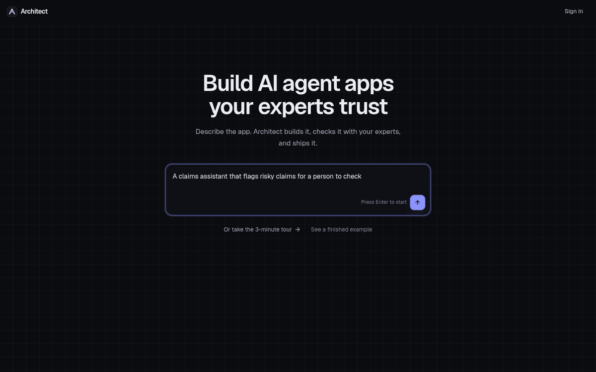
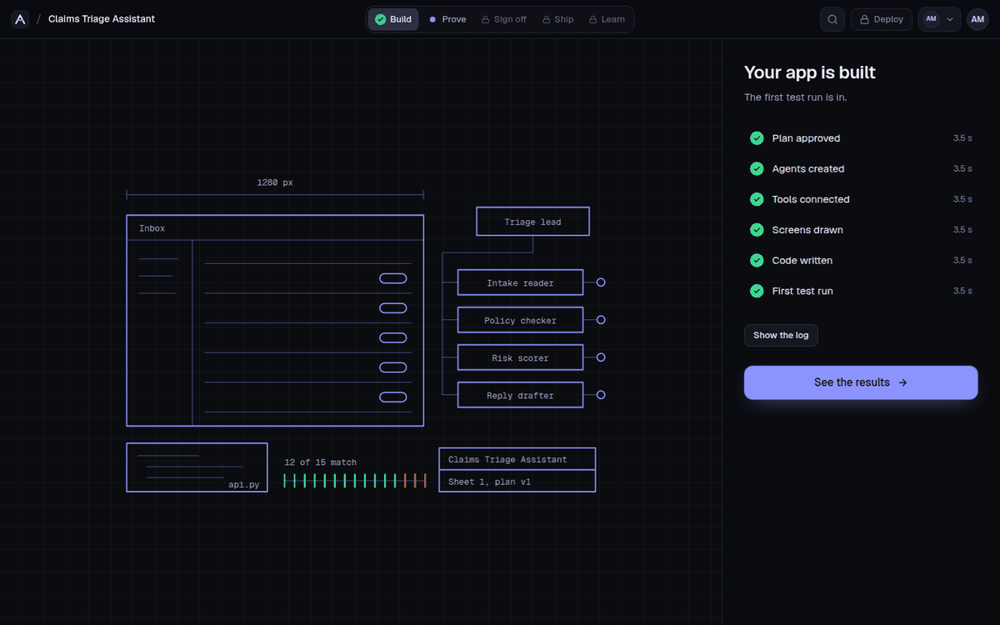
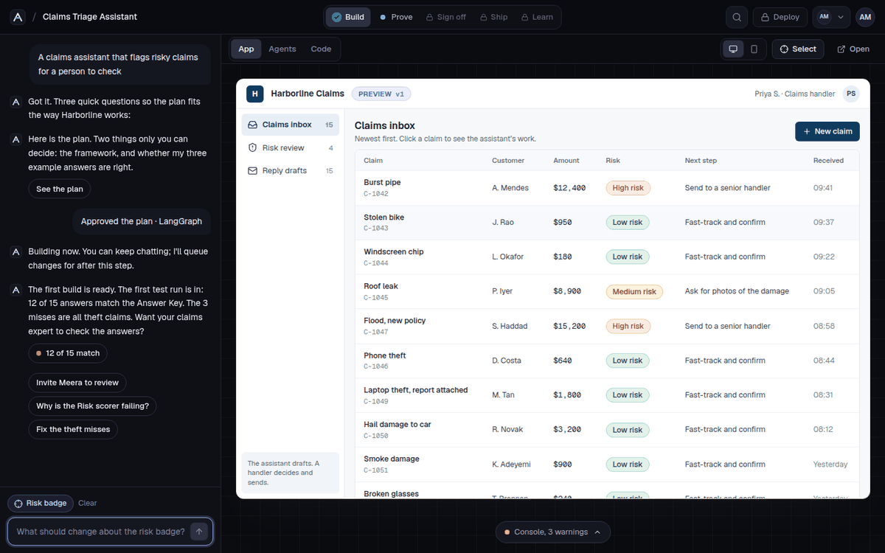
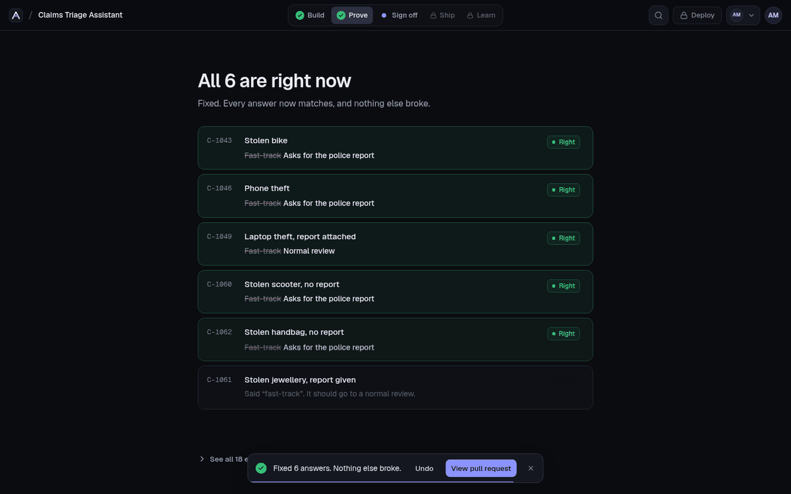
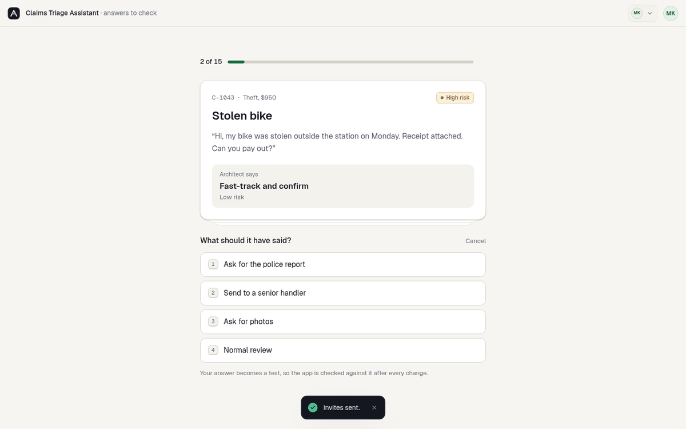
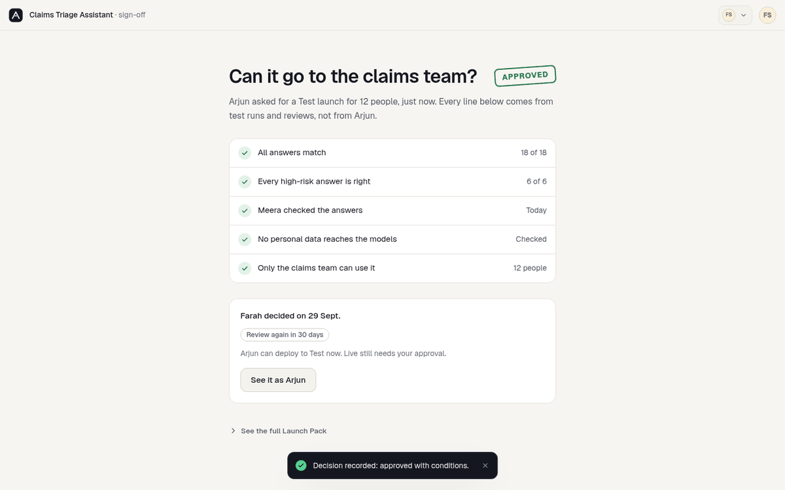
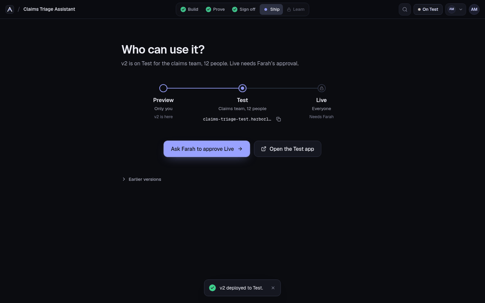
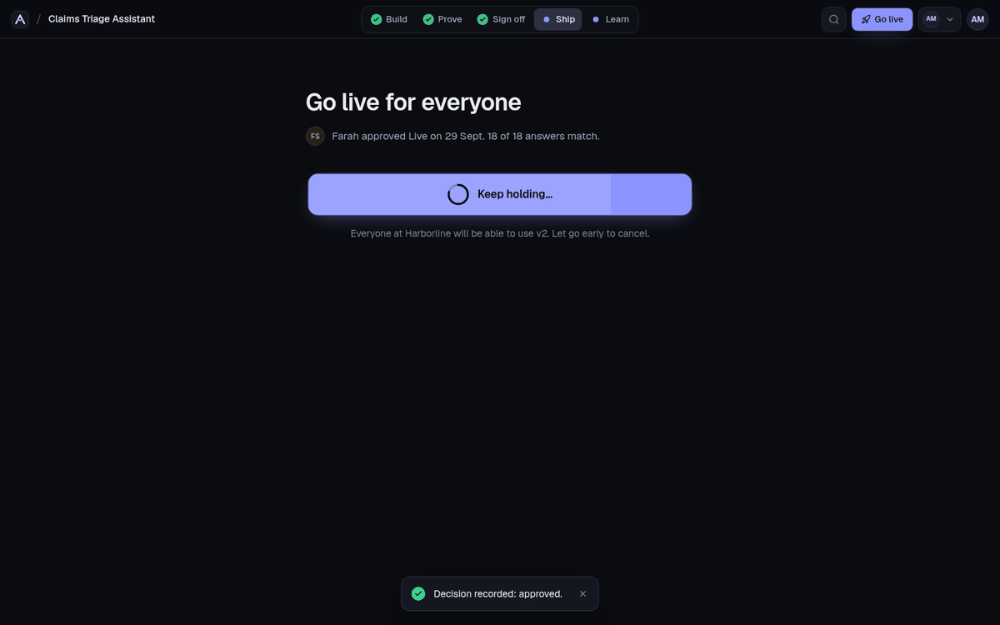

# Architect 2.0 · Build AI agent apps your experts trust

A working prototype of the next version of [architect.new](https://architect.new): build an AI agent app from a sentence or from your own repo (two ways in, one app), **prove** it with your expert's examples, and **ship** it with IT's sign-off.

**Live:** [architect-2-0-alpha.vercel.app](https://architect-2-0-alpha.vercel.app) · **New here?** Press **Take the 3-minute tour** on the front page. No sign-in needed; a narrator builds a real app with you and can do each step for you.

**The documents** (PRD, journeys, design, brand guide, blueprint) are in [`docs/`](docs/README.md), written so anyone can follow them.

| | | | |
|---|---|---|---|
|  |  |  |  |
| **Describe it.** One box, one job. | **Watch it build.** A drawing of the app fills in. | **Point and ask.** Click any part to change it. | **Fix what's wrong.** Each row turns right; Undo is one click. |
|  |  |  |  |
| **The expert checks.** Right, wrong, not sure. | **IT signs off** from one page of facts. | **Pilot first.** Preview → Test → Live. | **Go live on purpose.** Press and hold. |

---

## The problem

> Building an agent app is now the easy part. Getting a company to trust it is the hard part.

A developer can build an agent app in days. What stops it going live is **trust**. The business expert is the only one who knows whether an answer is right, and IT must approve anything that touches customer data. Today the expert's checks arrive as screenshots, nobody reruns the examples after a fix, and IT is handed a slide deck instead of evidence. So the app stalls between demo and launch.

## The idea: one loop for three people

**Build → Prove → Sign off → Ship → Learn**

| Step | Who | What happens |
|---|---|---|
| **Build** | Arjun, the builder | Two ways in: **Describe it** (answer 3 quick questions, approve a 4-line plan with the cost shown first, watch it build) or **Bring your code** from GitHub. Agents in LangGraph, CrewAI, OpenAI Agents SDK, Google ADK or Lyzr. |
| **Prove** | Meera, the expert | Every change reruns the **Answer Key**, her own examples. She marks answers right or wrong without ever seeing code, and each correction becomes a new test. |
| **Sign off** | Farah, from IT | She approves from a one-page **Launch Pack** built from the evidence, checked against **launch rules** she sets once. Small, safe updates take a **fast lane**. |
| **Ship** | Arjun | Preview → Test (a pilot group) → Live (everyone, press and hold), with rollback. Every deployed version is also an API. |
| **Learn** | Everyone using it | People flag wrong answers; flags go to Meera and become tests; the loop starts again. |

## Three people, one project

The **View as** switch (top right) shows the same project as each person, so one visitor can play all three. The guided tour switches for you.

| Person | Role | Sees |
|---|---|---|
| **Arjun Mehta** | Builder, senior AI engineer | Everything. The code, the build log and API keys sit up front while **Developer tools** are on |
| **Meera Krishnan** | Expert, claims operations lead | Answers to check, on a light, quiet screen. No code. |
| **Farah Siddiqui** | IT and security lead | One-page decisions and her launch rules. No code. |

The demo company, **Harborline Insurance**, is made up.

## Demo script (about 3 minutes)

**Fastest:** on the front page, press **Take the 3-minute tour**. Or by hand:

1. Type an idea on the front page and press **Enter** (or pick **Bring your code** and paste a repo). Sign in: with email you go straight to Home; with **Continue with GitHub** you answer one question about saving code first.
2. On Home, press **Enter**. Answer the **3 questions** with the keys 1, 2, 3. Read the plan, press **Build it**.
3. Watch the drawing fill in (or **Skip the wait**). **See the results**: *12 of 15 answers match. The 3 that miss are all theft claims.*
4. **Open the app.** Press **Select**, click a risk badge, and ask for a change. Look at **Agents** (hover one) and **Code** (with developer tools off, it's in the **</>** menu; turn them on in Settings, the account menu or ⌘K).
5. **See the 3 misses** → **Ask Meera to check them** → type "me", **Enter**, **Send invite**.
6. **See it as Meera.** Press **R** for right, or **W** for wrong and then pick what it should have said (keys 1-4). The three theft answers are the wrong ones.
7. Back as Arjun, **Fix all 6**. Watch the rows turn right, see *Nothing else broke*, then **View pull request** → checks tick → **Merge**.
8. **Ask Farah to sign off** → **Send to Farah** → **See it as Farah** → add a condition → **Approve for Test**.
9. **See it as Arjun** → **Deploy v2 to Test**. About 25 seconds later, handlers flag two water-damage answers: **Flags** → **Turn 2 flags into tests**.
10. **Ask Farah to approve Live**, approve, then **Hold to go live**. Try **Use it from your code** → **Send a test request**.

Anywhere: press **⌘K** (or **Ctrl K**) to jump to any screen or run any action. Short on time? **See a finished example** on the front page. Start over from the account menu → **Reset the demo**.

## What's in it

| The brief asks for | Where | What works |
|---|---|---|
| Sign-in | `/signin`, `/setup` | **Real accounts** (email and password) and **Sign in with GitHub**, with secure sessions. The first option follows the way in: email for **Describe it**, GitHub for **Bring your code**. Email sign-ins skip the GitHub question. Demo sign-in when no database is set. |
| Homepage | `/`, `/home` | Two ways in: **Describe it** or **Bring your code**. Home changes with the person. **Arjun:** the prompt box with the **+ menu** (attach files, Lyzr Studio agents, prompt library), **Guided / One Shot**, starters, **Not sure what to build?** (AI Consultant), or a repo box with three of his repos, then recent projects. **Meera** and **Farah** see only what's waiting for them. |
| Technical and non-technical builders | **Developer tools** (Settings, account menu, ⌘K) | One app for both. On: a Code tab, the raw build log beside the drawing, API keys on Ship. Off: all of it tucked in a **</>** menu. On by default after a GitHub sign-in or bringing code, off after describing an app with email. |
| Chat window | Left side of **App · Agents · Code** | Ask for changes; open questions get answers from a **real AI model** when a key is set. Each change comes back with **Undo** and a pull request. |
| Live preview | **App** | The generated app on desktop or phone, **point-and-ask** (Select, click, describe), and a console with every mismatch. |
| Agents | **Agents** | The agent map: hover to see who talks to whom, click to open instructions, model and safety rules. |
| The UI getting built | **Building** | A technical drawing of the app fills in layer by layer while the steps tick, with the raw log one click away. |
| GitHub | Setup, **Import**, **Code**, pull requests | **Real GitHub:** your repos, reading any public repo, **pushing the generated code to a new repo**, and **opening real pull requests** with the test report. |
| Publishing | **Sign off**, **Ship**, **Go live** | Launch rules and requests, then Preview → Test → Live, fast lane, press-and-hold to go live, rollback and working app addresses. |
| For developers | **Use it from your code**, **Code** | **Every deployed app is also an API:** a key per environment, curl / Python / JavaScript that read the key from the environment, and **Send a test request**. The generated code includes the same API (FastAPI) and tests you can run with `pytest`. |
| Beyond the brief | **Prove**, Meera's review, Farah's page, **Flags**, ⌘K, the tour | Answer Key, expert review, launch rules, flags that become tests, audit trail with CSV export, a command palette and a guided tour. |

### Real vs simulated

**Real:** accounts, sessions and the Postgres database (when `DATABASE_URL` is set) · GitHub sign-in, your repos, new repos, commits and pull requests (when the GitHub OAuth app is set) · AI answers in chat, the agent playground and the AI Consultant (when an AI key is set) · the agent decision engine (the same rules as the generated Python) · test runs, pass/fail and step-by-step traces · reviews that become tests, with a guard against a fix memorising one case · launch rules, approvals with conditions, fast lane, deploy gating and rollback · the audit trail · the generated code · repo analysis · the public API · sync across browser tabs.

**Simulated, to keep the demo repeatable:** the engine's decisions come from rules, not model calls, so the story (12 of 15, then fixed) is the same for everyone · whole-app generation is scripted · hosting (deployed apps run inside the prototype at `/apps/<id>`) · Gmail, the claims database, Slack and Lyzr Studio agents · live traffic.

Without any keys, everything still works in demo mode, and work is saved in the browser.

## Call a deployed app from your code

Every app you deploy is also an API. Try it with the shared demo key:

```bash
curl -X POST https://architect-2-0-alpha.vercel.app/api/v1/claims/triage \
  -H "Authorization: Bearer ak_demo" \
  -H "Content-Type: application/json" \
  -d '{"kind": "theft", "amount": 950, "police_report": false}'
```

You get back the decision (`risk`, `next_step`, `reasons`, `draft_reply`) and every agent's step. In the app, **Use it from your code** gives each environment its own key, which runs exactly the version deployed there.

## Run it locally

```bash
npm install
npm run dev        # http://localhost:3000
```

No keys are needed. For a local database, run `node scripts/local-db.mjs` and set `DATABASE_URL=postgres://postgres@127.0.0.1:5433/postgres`.

## Deploy to Vercel

1. Go to [vercel.com/new](https://vercel.com/new), import this repository and press **Deploy**. No settings are needed.
2. Turn on the real features in **Settings → Environment Variables**, then redeploy:

| Setting | How to get it | What it turns on |
|---|---|---|
| `DATABASE_URL` | **Storage → Create Database → Neon**, connected to the project | Real accounts, with each person's work saved |
| `GITHUB_CLIENT_ID`, `GITHUB_CLIENT_SECRET` | github.com → Settings → Developer settings → OAuth Apps → New. Redirect URI: `https://<your-site>/api/auth/github/callback`. Untick **Expire user access tokens**. | Sign in with GitHub, your repos, pushing code, pull requests |
| `APP_URL` (recommended) | Your site's address | Makes GitHub always return people there |
| `ANTHROPIC_API_KEY` or `OPENAI_API_KEY` | console.anthropic.com or platform.openai.com | Real AI answers |
| `GITHUB_TOKEN` (optional) | A read-only GitHub token | Higher limits for reading public repos |

Tables are created automatically; there's no SQL to run. See [`.env.example`](.env.example). `/api/health` shows which features are on.

## How it's built

Next.js 15 (App Router) · React 19 · TypeScript · Tailwind CSS · Zustand · Postgres (Neon) · GitHub OAuth and REST · Anthropic or OpenAI · JSZip · Geist

```
src/app/                 22 one-job screens (see docs/journeys.md) and the API routes
src/components/ui.tsx    the kit: buttons that show their work, hold-to-confirm, gliding tabs, toasts with Undo
src/components/          app shell, project frame, command palette, guided tour, build drawing, chat
src/lib/store.ts         app state and every action: build, review, fix, request, decide, deploy
src/lib/engine.ts        the agents' decision rules, test runs and launch-rule checks
src/lib/codegen.ts       the code Architect generates, for each framework
src/server/              accounts and sessions, Postgres, GitHub, AI, API keys
docs/                    PRD, journeys, design, brand guide, blueprint
```

The full technical design, including the one structural decision and the build plan, is in [docs/blueprint.md](docs/blueprint.md).

## Design principles

- **One screen, one job.** Every screen answers one question and has one main button.
- **Two ways in, one app.** Describe it, or bring your code. Nobody is asked whether they're technical; developer tools follow the way you came in, and one switch changes them.
- **Never a frozen click.** Placeholders shaped like the next screen, a thin line when a move takes a moment, and every project screen loaded in the background.
- **The loop is the map.** A project's only menu is Build · Prove · Sign off · Ship · Learn, showing what's done, what's happening and what's locked.
- **Each person sees only their job.** Meera sees answers, never code. Farah sees evidence, never code.
- **Show what happened.** Buttons show busy and done; fixes show exactly what changed, with Undo.
- **Evidence, not claims.** Every line Farah reads comes from a test run, a review or a setting.
- **Plain words.** "3 answers are wrong", not "3 eval failures".
- **No lock-in.** Agents are described once and generated for any framework; the code lives in your GitHub.

More in [docs/design.md](docs/design.md) and the [brand guide](https://architect-2-0-alpha.vercel.app/brand-guide.html).
