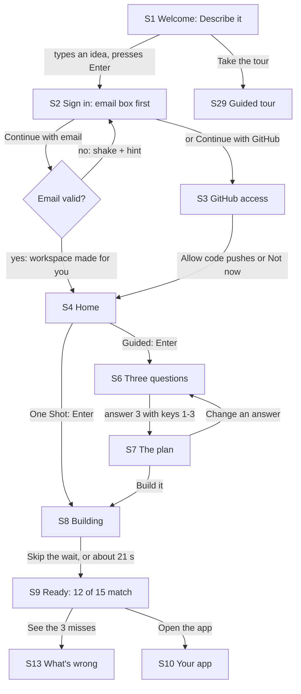
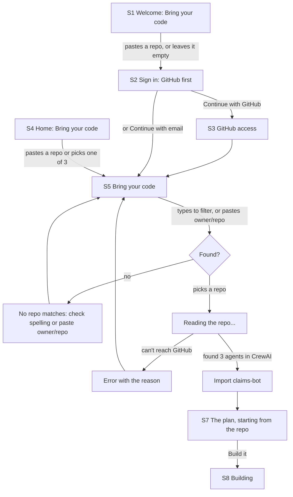
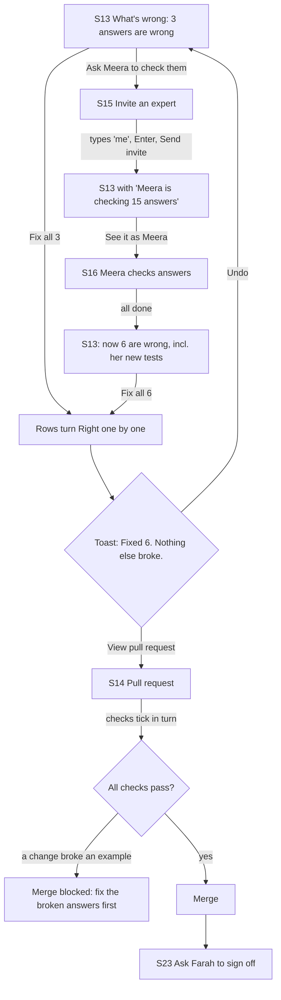
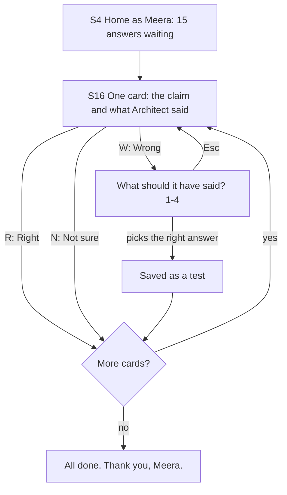
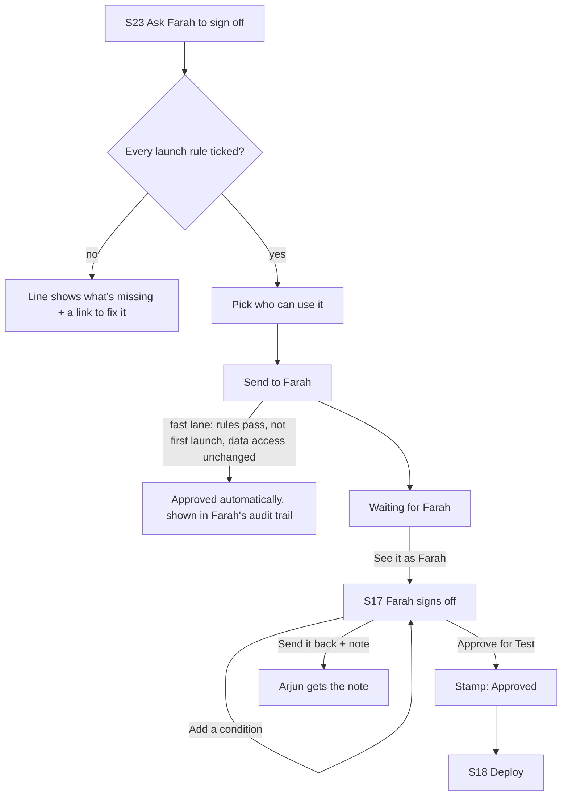
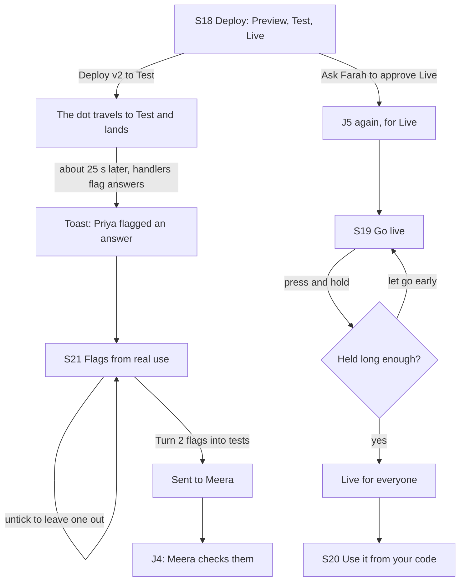
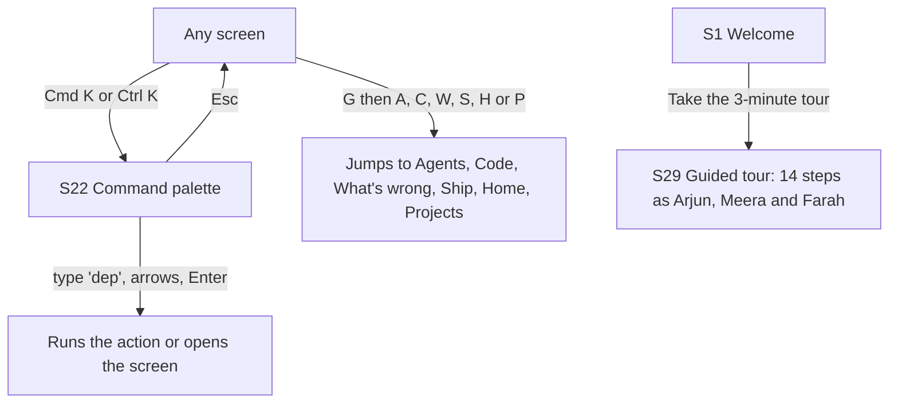

# Architect 2.0 — User Journeys

Source PRD: [prd.md](prd.md) (2026-09-29)

Each journey is one person trying to get one thing done, from the first click to the last. Screens are numbered **S1–S22** to match the clickable prototype; supporting screens are **S23+**. The live app is the visual truth: [architect-2-0-alpha.vercel.app](https://architect-2-0-alpha.vercel.app).

## Personas

**Arjun Mehta, the builder.** Senior AI engineer at Harborline Insurance (a made-up company). He wants to build the claims assistant quickly, keep the code in his own GitHub in the framework he likes, and get it live without writing a slide deck. He sees everything, including the code.

**Meera Krishnan, the expert.** Runs claims operations. She knows the right answer to every claim but doesn't read code or dashboards. She wants to check answers quickly and know her corrections stick. She only ever sees answers, on a light, calm screen.

**Farah Siddiqui, IT.** Leads IT and security. Anything touching customer data needs her yes. She wants facts she can trust, not a pitch, and she wants to set her rules once. She sees evidence and rules, never code.

## Journeys

### J1 — Arjun: build the first app from a sentence

**Entry points:** the welcome page ("Describe it" is the first of the two ways in; typing an idea there saves it for later), Home, or the guided tour.

**Steps**
1. **S1 Welcome.** One headline, two ways in (**Describe it** · **Bring your code**), one box. Typing wakes up the send button; Enter starts. The idea is saved in the browser so it survives signing in.
2. **S2 Sign in.** Someone who described an app gets the email box ready to type in, with GitHub as the second option. A bad email shakes the form and says exactly what's missing ("Add the full address, like arjun@harborline.com"). Signing in with email skips S3: the workspace is made from the email address, and GitHub can be connected later.
3. **S3 GitHub access.** Only for people who signed in with GitHub. One question: save the code to GitHub? The workspace is created for you with sensible defaults, so there is nothing else to fill in.
4. **S4 Home.** "What should we build, Arjun?" The saved idea is already in the box. Guided (questions and a plan first) or One Shot (build straight away).
5. **S6 Three questions.** One at a time; press 1, 2 or 3. Back goes to the previous question.
6. **S7 The plan.** Four plain lines, the framework (a menu), the cost ("About 140 credits"), and details hidden behind "See every agent and screen". Nothing is built until **Build it**.
7. **S8 Building.** A drawing of the app fills in, layer by layer, while six steps tick off with the time left. "Show the log" swaps the drawing for the raw log.
8. **S9 Ready.** It reads like a marked exam. A ring counts up to the score, then one line says what was tested: "Architect tested it on 15 example claims, each with the right answer already written down. 12 match. The 3 that miss are all theft claims." Below it, all 15 examples appear as small squares (green tick, red cross; point at one to see the claim), the main button, and one miss shown side by side: what the app said ("Fast-track: pay it quickly") next to the right answer ("Hold it: ask for the police report first").

**Exit states:** success is S9, then S13 or S10. Leaving mid-way is safe: everything is saved, and opening the project again lands on the right step (a plan waiting for approval opens S7, a build in progress opens S8).

### J2 — Arjun: bring in a repo he already has

**Entry points:** "Bring your code" on the welcome page or on Home (the second way in), or the command palette.

**Steps:** a repo named on the welcome page or Home is read straight away; otherwise search or paste a repo → pick it → a one-line summary of what was found ("Found 3 agents written in CrewAI. There are no tests yet, so we'll start an Answer Key with your experts.") → the button morphs from "Pick a repo to import" to "Import claims-bot" to "Imported" → a plan that keeps the existing agents and only adds what's missing.

**Exit states:** success is the plan. With GitHub connected, the list shows your real repos; any public repo can be pasted and is read for real. A repo that isn't written as owner/name or a github.com link gets a plain error before anything else happens. Bringing code turns developer tools on (see Decisions).

### J3 — Arjun and Meera: prove the answers

**Entry points:** S9 "See the misses", the Prove step in the top bar, or a chat chip.

**Steps**
1. **S13** lists each wrong answer in one sentence: "Said 'fast-track'. It should ask for the police report." One reason for all of them: "All three are theft claims. Your policy says theft needs a police report first."
2. **S15** invite: type a name, Enter picks the person, Backspace removes one. "They check answers in plain words and never see code." There's also "Copy invite link".
3. Meera reviews (J4). Her corrections add new examples, so the Answer Key grows from 15 to 18.
4. **Fix all** runs the fix, reruns every example, and turns each row from Wrong to Right with a short stagger. A toast says what happened, with **Undo** and **View pull request**. The toast waits while you hover it.
5. **S14** the three checks tick in turn (Answer Key, unit tests, Meera's new tests). Merge opens only when they pass.

**Exit states:** merged → ask Farah (J5). Undo returns to the previous version and reruns the examples.

### J4 — Meera: check the answers

**Entry points:** the invite link, her Home ("15 answers are waiting for you"), or "See it as Meera".

**Steps:** one card at a time, with the claim in the customer's words and "Architect says: Fast-track and confirm". Right (R), Wrong (W) or Not sure (N). After Wrong, four choices (keys 1-4). The card flies off in the direction of the answer; the progress bar fills; "Saved as a test" flashes after a correction.

**Exit states:** "All done" with what happened ("Your 3 corrections are now tests, so the same mistake can't come back."). Leaving mid-way keeps her place.

### J5 — Arjun and Farah: sign off

**Entry points:** S14 after merging, S13 "Ask Farah to sign off", the Sign off step, or the command palette.

**Steps:** S23 shows the four launch rules as ticked lines, with a fix link on any that fail. Arjun picks who can use it (claims team, 12 people, or all claims handlers, 40). On S17 Farah reads five ticked facts ("Every line below comes from test runs and reviews, not from Arjun"), can add conditions ("Review again in 30 days", "At most 50 claims a day", "A person sends every reply"), and approves. A stamp lands: **Approved**. "Arjun can deploy to Test now. Live still needs your approval."

**Exit states:** approved → S18; sent back → Arjun sees her note and sends a new request. The full Launch Pack is one click away behind "See the full Launch Pack".

### J6 — Arjun: ship, then learn

**Entry points:** the Deploy button in the top bar (locked, with the reason, until Farah signs off), the Ship step, or S17.

**Steps**
1. **S18** Preview (only you) → Test (the pilot group) → Live (everyone). The Live stop is locked until approved. Deploying moves a dot along the track; the Test stop lands with a pulse and shows its address with a copy button.
2. **S21** flags arrive from the pilot with who flagged them and why. The button counts what's ticked: "Turn 2 flags into tests".
3. **S19** "Go live for everyone." Press and hold for about a second; a ring fills; "Keep holding…"; letting go early runs it back. Then "Live for everyone" and the live address.
4. **S20** a key per environment (hidden until you press the eye, and it hides again after 6 seconds), code in curl, Python and JavaScript that reads the key from the environment, and **Send a test request** that shows the real response line by line with "200 in 38 ms".

**Exit states:** live; rollback is under "Earlier versions" on S18.

### J7 — Anyone: find anything, or watch it all

**Steps:** the palette lists actions that make sense right now (Fix the wrong answers, Run all tests, Deploy, Ask Farah), places to go, key files and "See it as Meera / Farah". The guided tour builds a real app and highlights the one thing to press on each step, or does it for you.

## Story traceability

| Story | Journey(s) | Notes |
|---|---|---|
| U1 Describe → questions → plan | J1 | |
| U2 Watch it build, get a score | J1 | |
| U3 Import a repo | J2 | |
| U4 Invite the expert | J3 | |
| U5 Right / wrong / not sure | J4 | |
| U6 Fix all with Undo | J3 | |
| U7 Pull request with checks | J3 | |
| U8 One page of facts | J5 | |
| U9 Conditions | J5 | |
| U10 Launch rules set once | J5 | Rules live in Settings (S27) |
| U11 Pilot first | J6 | |
| U12 Press and hold to go live | J6 | |
| U13 Call it as an API | J6 | |
| U14 Flags become tests | J6, J4 | |
| U15 Keyboard: ⌘K | J7 | |
| U16 Guided tour | J7 | |
| U17 View as each person | J3, J4, J5 | The "View as" switch in every top bar |

## Screen inventory

Every screen the journeys use. **Loading** means: the moment you click, a thin line appears at the top if the next screen takes more than a beat, and the next screen's frame appears with grey shapes where its content goes (the top bar is the real one, so only the middle changes). Every screen of a project is loaded in the background as soon as you open the project, so most moves are instant and show neither. Signed-out visitors are sent to S2; signed-in visitors without a workspace are sent to S3.

### S1 — Welcome · `/`
**Purpose:** say what this is, and start by typing. **Appears in:** J1, J7.
**Contents:** headline "Build AI agent apps your experts trust", one line of explanation, the two ways in (**Describe it** · **Bring your code**), the box for the chosen way, "Or take the 3-minute tour", "See a finished example".

| State | Behaviour |
|---|---|
| Empty box | Send button asleep (grey); the hint "Press Enter to start" hidden |
| Typing | Send button wakes (iris, glow); hint appears |
| Bring your code | One line for a repo; a bad one gets a red border and a plain fix ("Try owner/name, or paste its github.com link") |
| Already signed in | The page still shows. Top right says "Your projects"; typing an idea goes straight to its three questions, a repo straight to S5 |

### S2 — Sign in · `/signin`
**Purpose:** get in without thinking. **Appears in:** J1.
**Contents:** "Sign in to start building" (or "Sign in to bring your code"), the saved idea or repo, the email form and Continue with GitHub in the order that fits the way in, "Open a finished example".

| State | Behaviour |
|---|---|
| Came in with "Describe it" (or directly) | Email box first, focused; "or"; Continue with GitHub, with one line on why a developer might pick it |
| Came in with "Bring your code" | Continue with GitHub first (Architect needs it to read the code); Continue with email second |
| Bad email | Form shakes; one-line hint in red |
| Real accounts on | Password field and "Create an account" appear |
| GitHub sign-in | Button says "Opening GitHub" while redirecting |
| GitHub error | The error from GitHub is shown under the buttons |

### S3 — GitHub access · `/setup`
**Purpose:** decide where the code lives. **Appears in:** J1, J2, only after signing in with GitHub.
**Contents:** "Save your code to GitHub?", the connected account, Allow code pushes, Not now.

| State | Behaviour |
|---|---|
| Real GitHub, pushes already allowed | One Continue button |
| Demo | "Allow code pushes" morphs to "Allowed" and continues |

### S4 — Home · `/home`
**Purpose:** say what to build. **Appears in:** J1, J2, J4, J5.
**Contents (Arjun):** "What should we build, Arjun?", the two ways in. **Describe it:** prompt box with + menu (attach files, Studio agents, prompt library), Guided / One Shot, three starters, "Not sure what to build?". **Bring your code:** one line for a repo and three of your repos as quick picks. Then up to 3 recent projects.
**Contents (Meera / Farah):** one card: what's waiting for them, or a calm "Nothing to check / decide right now".

| State | Behaviour |
|---|---|
| First visit | No Recent section |
| Idea from S1 | Pre-filled in the box |
| Came back after bringing code | "Bring your code" is already chosen (the way used last) |
| Meera, nothing waiting | "When Arjun sends answers for you to check, they show up here." |

### S5 — Bring your code · `/import`
**Purpose:** pick the repo. **Appears in:** J2.

| State | Behaviour |
|---|---|
| No match | "No repo matches that. Check the spelling, or paste owner/repo." |
| Pasted owner/repo | Extra row: "Read owner/repo from GitHub" |
| Reading | Spinner in the chosen row; button says "Reading the repo…" |
| Error | The reason in a red note; pick again |
| GitHub not connected (real mode) | "Connect GitHub to see your own repos" link |
| Arrived with a repo named | It is read straight away |

### S6 — Three questions · `/p/[id]/questions`
**Purpose:** answer three quick questions. **Appears in:** J1.

| State | Behaviour |
|---|---|
| Returning after the plan | Previous answers pre-selected |
| Plan already approved | Goes to the right step instead |

### S7 — The plan · `/p/[id]/plan`
**Purpose:** is this the right plan? **Appears in:** J1, J2.

| State | Behaviour |
|---|---|
| Imported project | Plan lines describe what changes in the repo; no "Change an answer" |
| Already approved | Goes to the right step |

### S8 — Building · `/p/[id]/build`
**Purpose:** what's happening and how long is left. **Appears in:** J1, J2.

| State | Behaviour |
|---|---|
| In progress | Drawing fills in; steps tick with times; "About N seconds left"; Skip the wait |
| Done | "Your app is built", all ticks, "See the results" |
| Log view | Raw log lines instead of the drawing |
| Developer tools on | The last lines of the raw log stay in view under the steps; the button says "Full log" |

### S9 — Ready · `/p/[id]/ready`
**Purpose:** did it work? **Appears in:** J1.
**Contents:** the score ring; one sentence on what was tested; the 15 examples as squares with a legend ("12 right · 3 wrong, all theft claims"); the main button; "One of the misses" (the claim, what the app said, the right answer, and the rule behind it); "Where do these 15 examples come from?" (3 from the plan, 12 written by Architect; the expert adds more; all rerun after every change).

| State | Behaviour |
|---|---|
| Some wrong | Ring in iris with a red remainder; "See the 3 misses" is the main button, in view even on a small laptop |
| All right | Ring in green; all squares green; no example card; "Open the app" is the main button |
| Pointing at a square | Tooltip: "C-1043 · Stolen bike · wrong" |

### S10 — Your app · `/p/[id]/app`
**Purpose:** does it look right? Change anything by pointing at it. **Appears in:** J1.
**Contents:** chat on the left; App / Agents / Code tabs (Code only with developer tools on; otherwise a </> button holds "See the code", "Use it from your code" and "Always show them"); the generated app (light); desktop / phone switch; Select; a console pill.

| State | Behaviour |
|---|---|
| Select on | Crosshair; hovering outlines a part and names it; clicking puts it in the chat ("What should change about the risk badge?") |
| Console open | Drawer with the request log and one warning per wrong answer; each warning opens S13 |
| Phone screen | Starts in the phone layout |

### S11 — Agents · `/p/[id]/agents`
**Purpose:** how it works inside. **Appears in:** J1.

| State | Behaviour |
|---|---|
| Hover an agent | Everything not connected to it fades; its connections light up |
| Click an agent | Drawer: what it does, what it uses, instructions (editable), safety rules (toggles) |
| Risk scorer has misses | Red count on the node and a warning in its drawer |

### S12 — Code · `/p/[id]/code`
**Purpose:** read the code, copy it, take it with you. **Appears in:** J1.

| State | Behaviour |
|---|---|
| A change selected in the branch menu | Shows the diff for that change |
| Real GitHub | "Save to GitHub" or "On GitHub" |
| Demo | The simulated repo name |
| Developer tools off | Reached from the </> menu or ⌘K; the Code tab shows while you're on it |

### S13 — What's wrong · `/p/[id]/prove`
**Purpose:** which answers are wrong, and fix them. **Appears in:** J3.

| State | Behaviour |
|---|---|
| Wrong answers | List + reason + Fix all + Ask Meera |
| Fixing | Rows turn Right one by one; toast with Undo |
| All right | Score ring + the one next step (invite Meera, wait for her, ask Farah, or ship) |
| Meera reviewing | A strip: "Meera is checking 15 answers · 4 done" + See it as Meera |
| Flags waiting | A strip linking to S21 |

### S14 — Pull request · `/p/[id]/pr/[cid]`
**Purpose:** is the change safe to merge? **Appears in:** J3.

| State | Behaviour |
|---|---|
| Checking | Spinners; "Waiting for 3 checks" |
| A change broke something | That check turns red; Merge blocked |
| Merged | Tag turns to Merged; "Ask Farah to sign off" |
| Undone | "Undone" tag; back to the answers |

### S15 — Invite an expert · overlay on S13
**Purpose:** who knows the right answers? **Appears in:** J3.

| State | Behaviour |
|---|---|
| Typing | Suggestions; Enter picks; Backspace removes the last person |
| A typed email | "Invite name@company.com" option |
| Nobody picked | Send invite disabled |

### S16 — Meera checks answers · `/p/[id]/review`
**Purpose:** is this answer right? **Appears in:** J4.

| State | Behaviour |
|---|---|
| Nothing to check | "Nothing to check right now" |
| After Wrong | Four choices, keys 1-4; Esc cancels |
| Done | "All done. Thank you, Meera." with what happened |

### S17 — Farah signs off · `/p/[id]/requests/[rid]`
**Purpose:** is it safe for these people? **Appears in:** J5.

| State | Behaviour |
|---|---|
| Viewed by Arjun | "Waiting for Farah" + See it as Farah (no decision buttons) |
| A rule fails | Red line with the value |
| Decided | Stamp (Approved / Sent back), conditions, next step |
| Fast lane | Stamp "Fast lane"; "Every launch rule passed, so this went through on its own" |

### S18 — Deploy · `/p/[id]/ship`
**Purpose:** who can use it right now? **Appears in:** J6.

| State | Behaviour |
|---|---|
| Nothing approved | "Ask Farah to sign off" |
| Test approved | "Deploy v2 to Test" |
| On Test | "Ask Farah to approve Live", "Open the Test app" |
| Waiting for Farah | Disabled "Waiting for Farah" |
| Live | "Open the live app", "Use it from your code"; rollback under Earlier versions |

### S19 — Go live · `/p/[id]/live`
**Purpose:** make it available to everyone, on purpose. **Appears in:** J6.

| State | Behaviour |
|---|---|
| Not approved for Live | "Live needs Farah's approval" + ask |
| Holding | Ring fills, "Keep holding…" |
| Released early | Ring runs back; nothing happens |
| Done | Green "Live for everyone" + the live address |

### S20 — Use it from your code · `/p/[id]/api`
**Purpose:** call it from your own systems. **Appears in:** J6.

| State | Behaviour |
|---|---|
| Nothing deployed | "Deploy it to Test first" + Go to Ship |
| No key yet | "Create a key" |
| Key shown | Visible for 6 seconds, then hidden again |
| Response | Streams in line by line; "200 in 38 ms" |
| Request fails | "The request did not reach the server." |

### S21 — Flags from real use · `/p/[id]/learn`
**Purpose:** turn what people flagged into tests. **Appears in:** J6.

| State | Behaviour |
|---|---|
| No flags yet, pilot running | "Show their flags now" (for the demo) |
| Not deployed | "Go to Ship" |
| None ticked | "Pick at least one flag" (disabled) |
| Sent | "Sent to Meera" + See it as Meera |

### S22 — Command palette · overlay, every screen
**Purpose:** do anything from the keyboard. **Appears in:** J7.

| State | Behaviour |
|---|---|
| No match | "Nothing matches 'x'. Try 'deploy', 'code' or 'Meera'." |
| Signed out | Doesn't open |

### Supporting screens

| # | Screen | Route | Purpose |
|---|---|---|---|
| S23 | Ask Farah to sign off | `/p/[id]/signoff` | Arjun sends the request, or sees where it stands |
| S24 | Farah's landing | `/p/[id]/requests` | Opens the waiting request, or "Nothing to decide yet" |
| S25 | Projects | `/projects` | Every project, one line each |
| S26 | Usage | `/usage` | Where the credits went |
| S27 | Settings / Launch rules | `/settings` | Launch rules (Farah edits), people, connections, audit trail |
| S28 | The deployed app | `/apps/[id]` | The app as its users see it, per environment |
| S29 | Guided tour | `/tour` | Starts a fresh project and narrates 14 steps |
| S30 | Finished example | `/demo` | Opens a ready-made project on S9 |
| — | Project not found | any `/p/...` | "This project isn't in this browser" + open a demo project |

## Decisions

| # | Question | Answer | Date | Reopen if |
|---|---|---|---|---|
| 1 | Who is it for: one person or three? | Three people, each seeing only their job (not "two views" of one screen) | 2026-09-24 | Experts or IT won't use their screens (H2, H3) |
| 2 | Does the expert see traces or code? | Never. A card with the case, the answer and three choices | 2026-09-24 | Experts ask for more detail |
| 3 | Who writes the Launch Pack? | Nobody. It's generated from runs, reviews and settings | 2026-09-24 | IT says it's missing something only a person can write |
| 4 | How many screens, and how dense? | 22 screens, one job each (the dense tab version was confusing) | 2026-09-29 | A test shows people get lost between screens |
| 5 | Which look? | The grey-black look from the first redesign draft, not blueprint blue | 2026-09-29 | |
| 6 | How does going live work? | Press and hold, about a second; letting go cancels | 2026-09-29 | People find it slow or confusing |
| 7 | Meera and Farah's screens | Light "paper" theme, so it feels like reading, not building | 2026-09-29 | |
| 8 | How do people switch roles in a demo? | A "View as" switch in the top bar; the tour switches for you | 2026-09-28 | Real multi-account use replaces the demo |
| 9 | When do pilot flags arrive? | About 25 seconds after deploying to Test, with a "Show them now" shortcut (demo timing) | 2026-09-28 | Real traffic replaces the simulation |
| 10 | How is a change made from the app preview? | Point-and-ask: Select, click the part, type what should change | 2026-09-29 | |
| 11 | What does the palette show? | Only actions that make sense now, plus places, files and people | 2026-09-29 | |
| 12 | Where does an API key appear in code? | Never. Examples read `ARCHITECT_KEY` from the environment | 2026-09-29 | |
| 13 | The first screen, for someone who's signed in | Always the welcome page; "Your projects" top right, and an idea goes straight to its questions (it used to jump to Home) | 2026-09-29 | |
| 14 | What shows between screens? | A thin line at the top if a move takes more than a beat, placeholders shaped like the next screen, and every project screen loaded in the background | 2026-09-29 | Moves still feel slow on the live site |
| 15 | Should today's Architect sit next to 2.0 as a second, "classic" app? | No. One app with two ways in (Describe it · Bring your code) and a Developer tools switch. A second app splits the pitch, doubles the work and starts with "are you technical?" | 2026-09-29 | Current Architect users can't find what they know; then add a "Coming from today's Architect?" guide |
| 16 | Who sees the code up front? | Developer tools: on after a GitHub sign-in or bringing code, off after "Describe it" with email. One switch in Settings, the account menu and ⌘K. Off means tucked in the </> menu, never removed | 2026-09-29 | Non-developers go looking for the code, or developers miss it |
| 17 | Which sign-in comes first? | The one that fits the way in: email for "Describe it", GitHub for "Bring your code". Email sign-ins skip the GitHub question | 2026-09-29 | Most people in a pilot sign in with GitHub anyway |
| 18 | How does the results screen explain "12 of 15 match"? | Like a marked exam: what was tested in one line, all 15 examples as squares, and one miss shown next to its right answer. Found when a first-time viewer couldn't follow the step without a walkthrough | 2026-09-30 | People still ask what "match" means |
